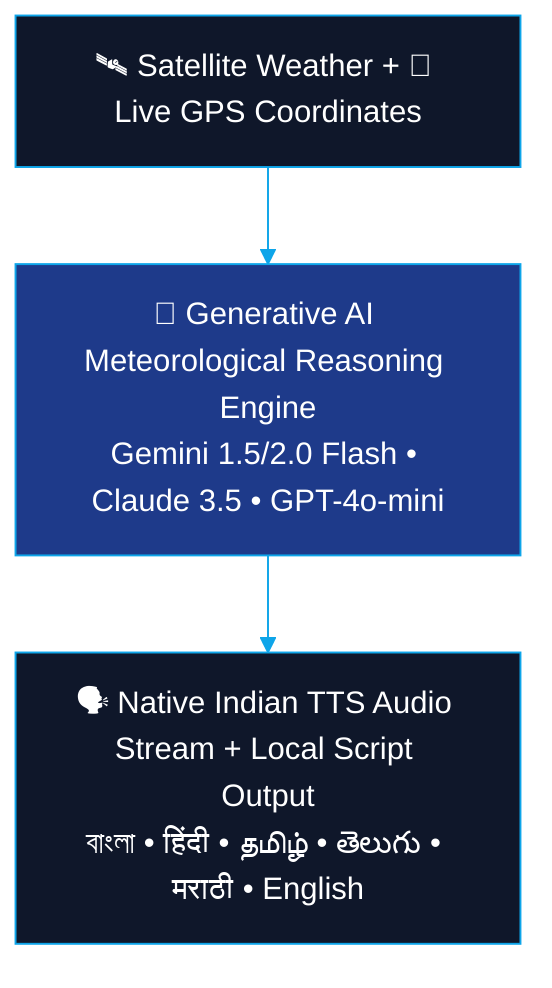

<div align="center">


<br/>

<a href="https://temp-gpt-ten.vercel.app/">
  
</a>

<br/><br/>


<br/><br/>


<br/><br/>

<p>
  <a href="#-key-features"><b>Key Features</b></a> •
  <a href="#-architecture"><b>Architecture</b></a> •
  <a href="#-persona-intelligence">Persona Matrix</a> •
  <a href="#-multilingual-support">Languages</a> •
  <a href="#-getting-started">Getting Started</a> •
  <a href="#-deployment">Deployment</a>
</p>

</div>


## 🌟 Overview

**WeatherGPT** is an AI-powered conversational weather platform designed specifically for India's diverse linguistic and agricultural landscape. Instead of complex meteorological graphs and raw numerical tables, WeatherGPT delivers **role-specific, conversational briefings in 6 native Indian scripts** with **two-way voice speech (STT & TTS)**, **live GPS locality detection**, and **dual-city side-by-side comparisons**.

<div align="center">




</div>

---

## ✨ Key Features

<table>
<tr>
<td width="50%" valign="top">

### 📍 Hyper-Local GPS & 4-Tier Geocoding
- **Instant GPS Detection** — one-click acquisition of exact latitude/longitude, zero manual city typing.
- **4-Tier Fallback Reverse Geocoding**:
  1. *BigDataCloud Client-side Geolocation API* (sub-locality precision)
  2. *OpenStreetMap Nominatim Engine*
  3. *Google Maps Reverse Geocoding API*
  4. *Haversine Nearest-Distance Matcher* across 100+ major Indian cities

</td>
<td width="50%" valign="top">

### 🧠 Persona-Tailored Meteorological Intelligence
WeatherGPT dynamically tailors advice, tone, and focal parameters by role:
- 🌾 **Farmer** (किसान / কৃষক) — soil moisture, irrigation windows, fertilizer scheduling, rainfall, pest advisories
- 🎣 **Fisherman** (मछुआरा / জেলে) — coastal wind (knots), high tide warnings, wave heights, squalls, deep-sea safety
- 🚨 **Disaster Manager** (आपदा प्रबंधक / দুর্যোগ ব্যবস্থাপক) — IMD alerts, cyclone trajectories, flood risk, shelters
- 👤 **Citizen** (नागरिक) — commute feasibility, clothing choices, umbrella alerts, travel advice

</td>
</tr>
<tr>
<td width="50%" valign="top">

### 🎙️ Full-Fidelity Voice Speech (STT & TTS)
- **Speech-to-Text** — speak naturally in Bengali, Hindi, Tamil, Telugu, Marathi, or English with live pulsing mic feedback.
- **Serverless Native TTS Streaming** (`/api/tts`):
  - Strips emojis & raw formatting so voice never stutters
  - Expands symbols (`২৯°C` → *২৯ ডিগ্রি সেলসিয়াস*, `৯১%` → *৯১ শতাংশ*, `১৬ কিমি/ঘণ্টা` → *১৬ কিলোমিটার প্রতি ঘণ্টা*)
  - Streams continuous concatenated MP3 audio without autoplay interruptions

</td>
<td width="50%" valign="top">

### ⚖️ Dual-City Compare Mode & 📅 Outlook
- Side-by-side comparison between your location and any second Indian city (*Kolkata vs Mumbai*, *Delhi vs Chennai*)
- Compares temperature, feels-like, humidity, wind velocity, UV rating in real time
- Interactive **7-Day** and **24-Hour** timeline sliders with rain-probability bars and sunrise/sunset timings

</td>
</tr>
</table>

---

## 🇮🇳 Supported Languages

<div align="center">

| Language | Native Script | Voice STT | Native Audio TTS |
| :---: | :---: | :---: | :---: |
| **Hindi** | हिंदी | ✅ | ✅ |
| **Bengali** | বাংলা | ✅ | ✅ |
| **Tamil** | தமிழ் | ✅ | ✅ |
| **Telugu** | తెలుగు | ✅ | ✅ |
| **Marathi** | मराठी | ✅ | ✅ |
| **English** | English (IN/Global) | ✅ | ✅ |


</div>

---

## 🏗️ Project Architecture

```
d:\Weather GPT\
├── src/
│   ├── app/
│   │   ├── api/
│   │   │   ├── chat/route.js          # Multi-LLM dispatcher (Gemini, Claude, OpenAI)
│   │   │   └── tts/route.js           # Serverless Native Indian TTS MP3 Audio Streamer
│   │   ├── globals.css                # Weather tint design tokens & animations
│   │   ├── layout.jsx                 # Root layout with Noto Indian Google Fonts
│   │   └── page.jsx                   # Main WeatherGPT orchestrator
│   ├── components/
│   │   ├── Sidebar/                   # Search, Persona selector, Weather widget
│   │   ├── Header/                    # Live GPS indicator, city title, compare mode
│   │   ├── Chat/                      # Message bubbles, TTS player, Quick chips
│   │   ├── Forecast/                  # 7-day & 24-hour sliders
│   │   ├── Modals/                    # Compare cities modal & GPS permission overlay
│   │   └── UI/                        # Alert banner, Toast notifications, ErrorBoundary
│   ├── hooks/
│   │   ├── useGeolocation.js          # GPS auto-detect state machine
│   │   ├── useWeather.js              # Google Weather & Open-Meteo fallback
│   │   ├── useSpeechRecognition.js    # STT voice recording
│   │   └── useSpeechSynthesis.js      # Continuous audio streaming hook
│   └── lib/
│       ├── config.js                  # Environment variable manager
│       ├── constants.js               # Indian cities DB, WMO weather table
│       ├── i18n.js                    # 6-language native UI dictionary
│       ├── geocoding.js               # 4-tier reverse geocoding engine
│       ├── weatherApi.js              # Google Weather & Open-Meteo normalizer
│       ├── llmService.js              # Meteorological reasoning engine
│       └── speech.js                  # Clean audio script processor
├── .env.example                       # Environment variables template
├── package.json                       # Next.js 14 & React 18 dependencies
├── vercel.json                        # Vercel deployment configuration
└── README.md
```

---

## 🚀 Getting Started

<table>
<tr><td>

**1. Clone the Repository**
```bash
git clone https://github.com/devashishgorai/WeatherGpt.git
cd WeatherGpt
```

**2. Install Dependencies**
```bash
npm install
```

**3. Configure Environment Variables**

Copy `.env.example` to `.env.local`:
```bash
cp .env.example .env.local
```

Fill in your API keys in `.env.local`:
```env
# 1. Google Maps & Weather API Key
NEXT_PUBLIC_GOOGLE_API_KEY=your_google_maps_api_key

# 2. Google Gemini API Key (100% Free from https://aistudio.google.com/)
NEXT_PUBLIC_GEMINI_API_KEY=your_gemini_api_key

# 3. Anthropic Claude Key (Optional)
NEXT_PUBLIC_CLAUDE_API_KEY=

# 4. OpenAI Key (Optional)
NEXT_PUBLIC_OPENAI_API_KEY=
```

**4. Run Development Server**
```bash
npm run dev
```
Open **https://temp-gpt-ten.vercel.app/** in your browser.

**5. Build for Production**
```bash
npm run build
npm start
```

</td></tr>
</table>

---

## 🌐 Deployment on Vercel

1. Push your code to your GitHub repository.
2. Go to **[vercel.com/new](https://vercel.com/new)** and import your repository.
3. In **Environment Variables**, add:
   - `NEXT_PUBLIC_GOOGLE_API_KEY`
   - `NEXT_PUBLIC_GEMINI_API_KEY`
   - `MONGODB_URI`
   - `AUTH_SESSION_SECRET`
   - `AUTH_DATA_ENCRYPTION_KEY`
   - `TWILIO_ACCOUNT_SID`
   - `TWILIO_AUTH_TOKEN`
   - `TWILIO_VERIFY_SERVICE_SID`
4. Set the variables for **Production** (and Preview if you test preview deployments). Signup requires `MONGODB_URI`, `AUTH_SESSION_SECRET`, and `AUTH_DATA_ENCRYPTION_KEY`; SMS login also requires the Twilio variables.
5. Redeploy after saving the variables — Vercel will automatically build and host the Next.js App Router application.

---

## 🔒 Privacy & Data Usage

> 🛡️ **Zero Location Tracking** — GPS coordinates are requested strictly locally in the browser to query meteorological radar data and are never stored or shared.
>
> 📡 **Local Fallback** — WeatherGPT functions seamlessly with smart built-in meteorological intelligence even when offline or without an active LLM key.

---

<div align="center">

### 💬 Built for Smart India Hackathon 2026


<br/>


</div>
